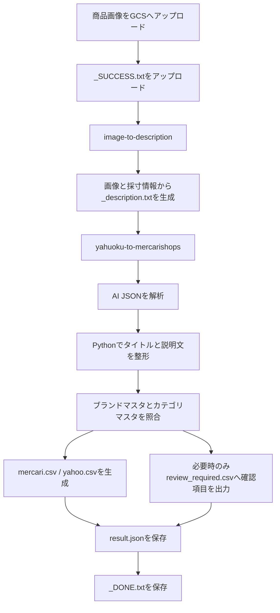

# Mercari Shops / Yahooオークション 自動出品CSV生成ツール

商品画像と採寸・状態メモから、メルカリShops用CSVとYahooオークション用CSVを生成するGoogle Cloud Functions構成のツールです。

最終目標は、外注スタッフが商品フォルダへ以下だけをアップロードすれば出品用CSVが生成される状態です。

- 商品画像
- `_SUCCESS.txt`

スプレッドシートは中間管理には使わず、最終成果物はCloud Storage上のCSVとJSONです。

## 出力物

`yahuoku-to-mercarishops` は `_description.txt` を入力として処理し、次の構成で成果物を保存します。

```text
exports/
  {batch_id}/
    mercari.csv
    yahoo.csv
    review_required.csv
    result.json
    _DONE.txt
```

`_DONE.txt` はCSVとJSONの生成が成功した場合のみ最後に作成されます。

## 全体フロー



## サービス構成

### image-to-description

`_SUCCESS.txt` のアップロードをトリガーに、同じ商品フォルダ内の画像と採寸・状態メモをGeminiへ送信し、商品説明生成用の `_description.txt` をCloud Storageへ保存します。

### yahuoku-to-mercarishops

`_description.txt` のアップロードをトリガーに、出品CSVを生成します。

主な処理は次の通りです。

- 同じ商品フォルダ内の画像URLをファイル名順に取得
- GeminiからJSON形式の商品属性を取得
- 商品タイトルをPython側で生成
- 説明文から `タイトル：` / `商品名：` / `説明文：` などの見出しを除去
- ブランド名をブランドマスタからブランドIDへ変換
- カテゴリ情報をカテゴリマスタからカテゴリIDへ変換
- 低信頼度またはマスタ未一致の項目を `review_required.csv` へ出力
- メルカリShops用CSVとYahooオークション用CSVを列名ベースで生成
- 処理結果を `result.json` に保存

## AI出力仕様

`yahuoku-to-mercarishops` では、AIに完成タイトルやIDを作らせません。AIは商品属性だけをJSONで返します。

```json
{
  "description": "商品説明本文",
  "brand_name": "D&G",
  "category_name": "ジャケット",
  "gender": "メンズ",
  "item_type": "ダウンジャケット",
  "material": "ナイロン",
  "color": "ブラック",
  "pattern": "無地",
  "size": "46",
  "condition": "美品",
  "confidence": {
    "brand": 0.9,
    "category": 0.85
  }
}
```

Markdownコードフェンス付きJSONにも対応しています。JSON解析に失敗した場合や必須本文が空の場合は、誤ったCSVを出力しないように例外で停止します。

## タイトル生成

タイトルはPython側で、次の順序を基本として生成します。

```text
状態 ブランド アイテム名 素材 色 柄 サイズ
```

空の項目は省略し、同じ単語の重複を避けます。`タイトル`、`商品名`、`説明文` などの見出しは含めません。

例:

```text
美品 D&G ダウンジャケット ナイロン ブラック 46
```

## CSV生成方針

CSVは列番号ではなく列名ベースで生成します。

```python
row["商品名"] = title
row["商品説明"] = description
row["ブランドID"] = brand_id
```

この方針により、旧実装で発生していたスプレッドシート `append_row()` による列ずれを回避します。

メルカリShops CSVヘッダーは公式サポートページから取得した `yahuoku-to-mercarishops/resources/mercari/product_import_template_sample.csv` の1行目を利用します。Yahooオークション側は現時点では既存定義を維持しています。

## ブランドマスタ

ブランドIDはAIに生成させず、ブランド名をマスタで照合します。

想定配置:

```text
masters/brand_master.csv
```

推奨列:

```csv
ブランドID,ブランド名,ブランド名（カナ）,ブランド名（英語）
123,Dolce&Gabbana,ドルチェアンドガッバーナ,Dolce&Gabbana
```

`aliases` は `|` 区切りです。標準で `D&G`、`Dolce&Gabbana`、`ドルガバ`、`ドルチェ&ガッバーナ` などは同一ブランドとして扱う補助辞書を持っています。

## カテゴリマスタ

カテゴリIDはAIに生成させず、性別・カテゴリ名・商品種別をマスタで照合します。

想定配置:

```text
masters/category_master_updated.csv
```

推奨列:

```csv
カテゴリID,カテゴリ名,カテゴリ名（フル）
456,ダウンジャケット,ファッション > メンズ > ジャケット・アウター > ダウンジャケット
```

カテゴリ信頼度が低い、またはマスタに一致しない場合は `review_required.csv` へ確認項目を出力します。

## サイズ処理

現時点ではメルカリShopsのネイティブサイズ設定は対象外です。

サイズは次の場所へ反映します。

- 商品名
- 商品説明
- メルカリShops CSVの `SKU1_種類`
- Yahooオークション CSVの `サイズ`

例:

```text
46
M相当
26.5cm
```

## review_required.csv

通常商品は確認CSVへ出力しません。確認が必要な商品のみ、次の列で出力します。

```csv
商品管理コード,確認項目,候補1,候補2,理由
```

主な出力条件:

- ブランドIDが特定できない
- カテゴリIDが特定できない
- AIのカテゴリ信頼度がしきい値未満

## result.json

処理結果をJSONで保存します。

```json
{
  "success": true,
  "product_code": "sample-item",
  "title": "美品 D&G ダウンジャケット ナイロン ブラック 46",
  "category_id": "456",
  "brand_id": "123",
  "review_required": false,
  "output_files": {
    "mercari_csv": "exports/sample-item/mercari.csv",
    "yahoo_csv": "exports/sample-item/yahoo.csv",
    "review_required_csv": "exports/sample-item/review_required.csv",
    "result_json": "exports/sample-item/result.json",
    "done": "exports/sample-item/_DONE.txt"
  }
}
```

## ディレクトリ構成

```text
image-to-description/
  main.py
  requirements.txt
  prompt.txt

yahuoku-to-mercarishops/
  main.py
  ai_service.py
  brand_mapper.py
  category_mapper.py
  csv_export.py
  listing_data.py
  title_builder.py
  requirements.txt

tests/
  test_listing_content_parser.py
  test_listing_data.py
  test_csv_export.py
  test_mappers.py
  test_main.py
```

## テスト

```powershell
python -m pytest -p no:cacheprovider tests
```

主に次を検証しています。

- 正常なJSONとMarkdownコードフェンス付きJSONの解析
- 見出し除去と説明文保持
- 空の説明文の検出
- Python側タイトル生成
- ブランド別名解決
- カテゴリ解決と低信頼度レビュー判定
- CSVの列名ベース生成
- 出力成果物パスと `_DONE.txt` 作成順
- 処理失敗時に元ファイルを処理済みにしないこと

## 必要な主なライブラリ

- functions-framework
- google-cloud-storage
- google-cloud-secret-manager
- google-generativeai
- google-auth

## 現在の制約

- メルカリShopsの公式テンプレート、ブランドマスタ、カテゴリマスタは同梱済みです。将来テンプレートが更新された場合は再取得が必要です。
- ブランドIDとカテゴリIDの精度は、`masters/brand_master.csv` と `masters/category_master_updated.csv` の整備品質に依存します。
- メルカリShopsのネイティブサイズ設定は今回の対象外です。
- 複数商品を1バッチで集約する構造は将来対応を見据えていますが、現在の実装は1商品フォルダ単位で成果物を生成します。
- AI生成内容は最終公開前に人が確認する前提です。