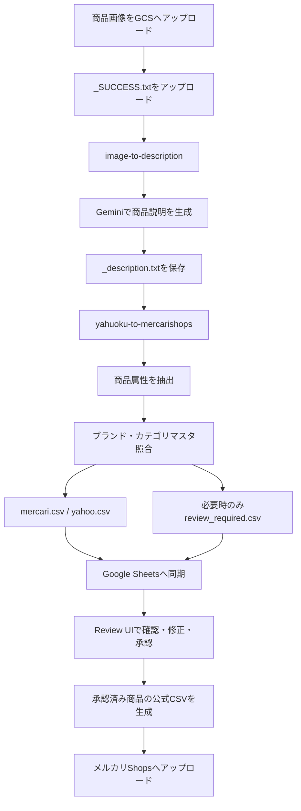

# 生成AIを活用したEC出品支援MVP

商品画像と採寸・状態メモから、メルカリShops／Yahooオークション向けの出品CSVを生成する業務支援ツールです。

個人で運営していたリユース事業において、商品説明の作成、商品属性の整理、CSV作成が出品数拡大のボトルネックになっていたため、Python、Gemini、Google Cloudを用いて開発しました。

AIの生成結果をそのまま確定せず、Review UIで人間が確認・修正・承認してから、メルカリShops公式形式のCSVを生成するHuman-in-the-loop型のMVPです。

## 30秒で分かる実績

- 商品画像と商品メモをGoogle Cloud Storageへ配置すると、Cloud Run functionsが自動起動
- Geminiを利用して、商品説明・商品属性・カテゴリ候補を生成
- メルカリShops向けCSVとYahooオークション向けCSVを出力
- Google SheetsとReview UIで、AI出力の確認・修正・承認が可能
- 承認済み商品のみ、メルカリShops公式形式のCSVとして再生成
- メルカリShopsへのCSVアップロード、下書き保存、商品画像表示まで実機検証済み
- Yahooオークション向けCSV生成は実装済み。ただしYahooオークション側への実投入は未検証

## 検証状況

| 項目 | 状態 |
|---|---|
| メルカリShops向けCSV生成 | 実装済み |
| Google Sheetsへの下書き・確認データ同期 | 動作確認済み |
| Review UIでの確認・修正・承認 | 実機検証済み |
| 承認済みCSVの生成 | 実機検証済み |
| メルカリShopsへのCSVアップロード | 実機検証済み |
| メルカリShops下書き保存 | 実機検証済み |
| 下書き画面での商品画像表示 | 実機検証済み |
| Yahooオークション向けCSV生成 | 実装済み |
| YahooオークションへのCSV実投入 | 未検証 |

## 解決したかった課題

リユース商品の出品では、商品ごとに次の作業が発生します。

- 商品画像の確認
- 採寸・状態メモの整理
- 商品タイトル・説明文の作成
- ブランド・カテゴリの特定
- 販売プラットフォームごとのCSV作成
- AI生成内容やCSV仕様の人間確認

作業量が増えるほど、説明文作成とCSV編集がボトルネックになります。一方、生成AIの出力を無確認で出品へ流すと、状態の過剰表現、カテゴリ誤判定、必須項目不足などの品質リスクが残ります。

そこで、文章生成だけではなく、入力、生成、マスタ照合、人間確認、公式CSV出力までを一つの業務フローとして設計しました。

## 技術スタック

| 区分 | 技術 |
|---|---|
| 言語・Web | Python、Flask |
| 生成AI | Gemini API、Vertex AI |
| クラウド | Cloud Run functions、Cloud Run、Cloud Storage、Secret Manager |
| 外部連携 | Google Sheets API |
| データ処理 | CSV、JSON、画像URL、ブランド・カテゴリマスタ |
| テスト | pytest |

## 担当範囲

個人開発として、次の工程を担当しています。

- 実務上のボトルネック特定
- 要件定義とMVPスコープの決定
- Google Cloud上の処理フロー設計
- Pythonによるバックエンド実装
- Gemini向けプロンプト設計・改善
- メルカリShops／Yahooオークション向けCSV変換
- Review UIと承認フローの設計・実装
- pytestによる回帰テスト・再実行テスト
- Cloud Run functions／Cloud Runへのデプロイ
- メルカリShopsでの実機検証
- README、運用手順、復旧手順の整備

## 全体フロー


```mermaid
flowchart TD
    A[商品画像をGCSへアップロード] --> B[_SUCCESS.txtをアップロード]
    B --> C[image-to-description]
    C --> D[Geminiで商品説明を生成]
    D --> E[_description.txtを保存]
    E --> F[yahuoku-to-mercarishops]
    F --> G[商品属性を抽出]
    G --> H[ブランド・カテゴリマスタ照合]
    H --> I[mercari.csv / yahoo.csv]
    H --> J[必要時のみreview_required.csv]
    I --> K[Google Sheetsへ同期]
    J --> K
    K --> L[Review UIで確認・修正・承認]
    L --> M[承認済み商品の公式CSVを生成]
    M --> N[メルカリShopsへアップロード]
```

## 技術的に工夫した点

### 1. AI出力を無条件で採用しない

AIのカテゴリ信頼度が低い場合、ブランド・カテゴリマスタと一致しない場合、または人間確認が必要な生成結果がある場合は、`review_required.csv` とGoogle Sheetsの確認対象へ出力します。

Review UIでは、商品情報を確認・修正し、承認済みの行だけを最終CSVへ含めます。

### 2. 再実行とbatch分離を考慮する

同一イベントが再実行されても重複行を増やさないようにし、複数batchのデータと生成CSVが混ざらないことを自動テストしています。

Google Sheets同期に失敗した場合は処理完了を示す `_DONE.txt` を作成せず、再実行対象として扱います。

### 3. 非公開画像を維持したまま公式CSVを作る

下書き段階では、非公開GCS画像の参照情報を保持します。

Review UIから最終CSVを生成する際のみ、メルカリShopsが画像を取得できる7日間有効の署名付きURLへ変換します。GCSバケット自体は公開しません。

### 4. CSV仕様違反を出力前に検出する

最終CSVはメルカリShops公式テンプレートと同じ88列、UTF-8 BOM付きで出力します。

商品画像、商品名、価格、カテゴリID、在庫、状態、配送項目などに仕様違反がある場合はCSVを生成せず、Review UIへ対象の商品管理コードと修正項目を表示します。

## 入力仕様

通常運用で商品フォルダへアップロードするものは次の2種類です。

- 商品画像
- `_SUCCESS.txt`

`_SUCCESS.txt` の本文に、採寸、状態、特記事項などの商品メモを書きます。`product_info.txt` は通常運用では使用しません。

```text
products/
  sample-item/
    001.jpg
    002.jpg
    _SUCCESS.txt
```

## 主な出力物

```text
exports/
  {batch_id}/
    mercari.csv
    yahoo.csv
    review_required.csv
    result.json
    _DONE.txt
    approved/
      mercari_shops.csv
```

| 出力物 | 用途 |
|---|---|
| `mercari.csv` | 商品単位のメルカリShops下書きデータ |
| `yahoo.csv` | Yahooオークション向けCSVデータ |
| `review_required.csv` | 人間確認が必要な項目の一覧 |
| `result.json` | 処理結果と生成ファイル情報 |
| `_DONE.txt` | 必要な出力と同期が完了したことを示すマーカー |
| `approved/mercari_shops.csv` | 承認済み商品のメルカリShops投入用CSV |

## サービス構成

### `image-to-description`

`_SUCCESS.txt` のアップロードをトリガーに、同じ商品フォルダ内の画像と採寸・状態メモをGeminiへ送信し、商品説明生成用の `_description.txt` をCloud Storageへ保存します。

### `yahuoku-to-mercarishops`

`_description.txt` のアップロードをトリガーに、次の処理を行います。

- 商品画像URLをファイル名順に取得
- Geminiから商品属性を取得
- 商品タイトル・商品説明をCSV仕様に合わせて整形
- ブランド名をブランドIDへ変換
- カテゴリ情報をカテゴリIDへ変換
- 確認対象を `review_required.csv` へ出力
- メルカリShops／Yahooオークション向けCSVを生成
- 処理結果を `result.json` へ保存
- 設定されている場合はGoogle Sheetsへ同期

### `review-ui`

Cloud Run上で動作するレビュー用フロントエンドです。

Google Sheets上の下書き行を確認・編集し、承認済みの行だけをメルカリShops投入用CSVとして再生成します。

## Google Sheets承認フロー

| シート | 用途 |
|---|---|
| `Draft_Mercari_List` | メルカリShops用の下書き行 |
| `Review_List` | 商品ごとの確認理由と承認状態 |
| `Approved_Mercari_CSV` | 承認済み商品の最終CSV用データ |
| `Yahoo_List` | Yahooオークション向けCSV行 |

Cloud RunのGoogleログイン、サービスアカウント権限、Spreadsheet編集、商品画像表示、承認済みCSVのメルカリShops再投入まで実機確認済みです。

複数batchや障害時の再実行を含む運用耐性は継続して検証しています。

## セキュリティ方針

- APIキー本体はSecret Managerで管理
- `.env`、APIキー、実際のGCPプロジェクトID、バケット名、Spreadsheet ID、secret値はGit管理しない
- 商品画像を保存するGCSバケットは非公開
- 最終CSV生成時だけ期限付き署名URLを発行
- Cloud RunのReview UIはGoogleログインを前提にする

## テスト

通常のテスト:

```bash
python -m pytest -p no:cacheprovider tests
```

重複したテストファイル名を含む検証:

```bash
python -m pytest -q tests
python -m pytest -q image-to-description/test_image_description.py
python -m pytest -q tests image-to-description/test_image_description.py
```

現在のmainでは、標準テストは `110 passed`、重複したテストファイル名を含む全構成は `117 passed` です。

テストには、10商品×2batch、同一イベントの再実行、別batchのCSV分離、Google Sheets同期、Review UIの主要処理を含みます。

## 制約・未検証事項

- Yahooオークション向けCSV生成は実装済みですが、Yahooオークション側への実投入は未検証です
- AI生成結果は人間確認を前提にしています
- 署名付き画像URLの有効期間内にメルカリShopsへCSVを投入する必要があります
- 複数batchや外部API障害を含む長期運用耐性は継続検証中です
- Review UIのブラウザ操作を対象としたE2Eテストは未導入です

## ドキュメント

- [開発ロードマップ](docs/ROADMAP.md)
- [運用・復旧手順](docs/operations_runbook.md)
- [利用者向け確認事項](docs/user_action_checklist.md)

## 採用・面接での説明

> リユース事業の出品作業を効率化するため、商品画像と採寸・状態メモからメルカリShops向けCSVを生成するMVPを開発しました。AI出力をReview UIで確認・修正・承認し、公式形式のCSVをメルカリShopsへアップロードできるところまで実機検証済みです。

Yahooオークションについては「Yahooオークション向けCSV生成機能を実装」と説明し、「Yahooオークションへの出品まで実機検証済み」とは表現しません。