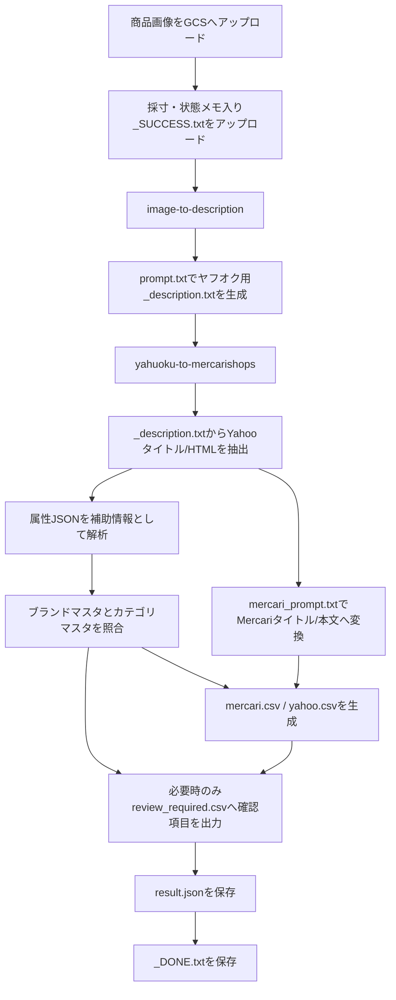

# Mercari Shops / Yahooオークション 自動出品CSV生成ツール

商品画像と `_SUCCESS.txt` に書かれた採寸・状態メモから、メルカリShops用CSVとYahooオークション用CSVを生成するGoogle Cloud Functions構成のツールです。

最終目標は、外注スタッフが商品フォルダへ以下だけをアップロードすれば出品用CSVが生成される状態です。

- 商品画像
- 採寸・状態メモを書いた `_SUCCESS.txt`

`product_info.txt` は通常運用では使用しません。

スプレッドシートは中間管理には使わず、最終成果物はCloud Storage上のCSVとJSONです。

## 出力物

`yahuoku-to-mercarishops` は `_description.txt` を入力として処理し、次の構成で成果物を保存します。

```text
exports/
  {batch_id}/
    mercari.csv
    yahoo.csv
    review_required.csv
    result.json
    _DONE.txt
```

`_DONE.txt` はCSVとJSONの生成が成功した場合のみ最後に作成されます。

## 外注者向けアップロード手順

1. 商品ごとにフォルダを作成する
2. 商品画像をアップロードする
3. 採寸情報・状態メモを書いた `_SUCCESS.txt` を最後にアップロードする
4. 処理完了後、`exports/{batch_id}/` に以下が生成される

```text
mercari.csv
yahoo.csv
review_required.csv
result.json
_DONE.txt
```

`_SUCCESS.txt` は処理開始トリガーであり、通常運用における唯一の外部入力メモです。`_SUCCESS.txt` の本文には採寸情報・状態メモを記載してください。本文が空の場合、`_description.txt` は生成せず、明確なエラーで停止します。

ファイル名は必ず `_SUCCESS.txt` にしてください。`_SUCCESS.TXT` や `_success.txt` では処理対象になりません。

入力例:

```text
ブランド：D&G
カテゴリ：ダウンジャケット
性別：メンズ
サイズ：46

採寸：
肩幅 45cm
身幅 52cm
着丈 68cm
袖丈 64cm

状態メモ：
右袖口に軽いスレあり。
前身頃に目立つ汚れなし。
ファスナー開閉確認済み。
```

## 全体フロー


```mermaid
flowchart TD
    A[商品画像をGCSへアップロード] --> B[採寸・状態メモ入り_SUCCESS.txtをアップロード]
    B --> C[image-to-description]
    C --> D[prompt.txtでヤフオク用_description.txtを生成]
    D --> E[yahuoku-to-mercarishops]
    E --> F[_description.txtからYahooタイトル/HTMLを抽出]
    F --> G[mercari_prompt.txtでMercariタイトル/本文へ変換]
    F --> H[属性JSONを補助情報として解析]
    H --> I[ブランドマスタとカテゴリマスタを照合]
    I --> J[mercari.csv / yahoo.csvを生成]
    G --> J
    I --> K[必要時のみreview_required.csvへ確認項目を出力]
    J --> K
    K --> L[result.jsonを保存]
    L --> M[_DONE.txtを保存]
```

## サービス構成

### image-to-description

`_SUCCESS.txt` のアップロードをトリガーに、同じ商品フォルダ内の画像と `_SUCCESS.txt` 本文の採寸・状態メモをGeminiへ送信し、`prompt.txt` に従ってヤフオク用のタイトルとHTML説明文を含む `_description.txt` をCloud Storageへ保存します。

通常経路では `product_info.txt` は読みません。採寸・状態メモは `_SUCCESS.txt` に集約します。

### yahuoku-to-mercarishops

`_description.txt` のアップロードをトリガーに、出品CSVを生成します。

主な処理は次の通りです。

- 同じ商品フォルダ内の画像URLをファイル名順に取得
- `_description.txt` からヤフオク用タイトルとHTML説明文を抽出
- Yahooオークション用CSVには `_description.txt` 由来のタイトルとHTML説明文を使用
- `mercari_prompt.txt` でヤフオク用タイトル・HTML説明文をメルカリShops用タイトル・本文へ変換
- メルカリShops用CSVには `[TITLE]` と `[BODY]` の変換結果を使用
- GeminiからJSON形式の商品属性を取得し、ID照合やSKUなどの補助情報にだけ利用
- 商品説明の誇張表現・断定表現を検出し、必要に応じて `review_required.csv` へ出力
- ブランド名をブランドマスタからブランドIDへ変換
- カテゴリ情報をカテゴリマスタからカテゴリIDへ変換
- 低信頼度またはマスタ未一致の項目を `review_required.csv` へ出力
- メルカリShops用CSVとYahooオークション用CSVを列名ベースで生成
- 処理結果を `result.json` に保存

## Google Cloud Run Functionsへのデプロイ

このリポジトリには実際のGoogle CloudプロジェクトID、バケット名、シークレット名、APIキー本体は含めません。環境ごとに異なる値はCloud Run Functionsの環境変数として設定します。

APIキー本体はSecret Managerへ保存し、`yahuoku-to-mercarishops` にはSecret Managerのシークレット名だけを渡します。

### 必須環境変数

#### image-to-description

| 環境変数 | 用途 | 例 |
| --- | --- | --- |
| `PROJECT_ID` | Vertex AIを利用するGoogle CloudプロジェクトID | `your-gcp-project-id` |
| `PROMPT_BUCKET_NAME` | プロンプトファイルを置くGCSバケット名 | `your-prompt-bucket` |
| `PROMPT_FILE_NAME` | `prompt.txt` のオブジェクト名 | `prompts/prompt.txt` |
| `VERTEX_LOCATION` | Vertex AIのリージョン | `asia-northeast1` |
| `VERTEX_MODEL` | Vertex AI Geminiモデル名 | `gemini-2.5-flash` |

#### yahuoku-to-mercarishops

| 環境変数 | 用途 | 例 |
| --- | --- | --- |
| `PROJECT_ID` | Secret Managerを利用するGoogle CloudプロジェクトID | `your-gcp-project-id` |
| `SECRET_NAME` | Gemini APIキーを保存したSecret Managerのシークレット名 | `gemini-api-key` |
| `PROMPT_BUCKET_NAME` | 属性抽出用プロンプトを置くGCSバケット名 | `your-prompt-bucket` |
| `PROMPT_FILE_NAME` | 属性抽出用プロンプトファイルのオブジェクト名 | `prompts/listing-attributes.txt` |
| `MERCARI_PROMPT_BUCKET_NAME` | メルカリ変換用プロンプトを置くGCSバケット名。未設定時は `PROMPT_BUCKET_NAME` を使用 | `your-prompt-bucket` |
| `MERCARI_PROMPT_FILE_NAME` | `mercari_prompt.txt` のオブジェクト名 | `prompts/mercari_prompt.txt` |
| `GEMINI_MODEL` | Gemini APIモデル名 | `gemini-2.5-flash-lite` |

ローカル確認用のサンプルは `.env.example` にあります。実際の値を書く `.env` はGit管理しません。

### デプロイコマンド例

`YOUR_REGION`、`YOUR_PRODUCT_BUCKET`、`YOUR_PROMPT_BUCKET`、`YOUR_PROJECT_ID` は自分の環境の値に置き換えてください。

#### image-to-description

- source directory: `image-to-description`
- entry point: `generate_description_from_trigger`
- trigger bucket: 商品画像と `_SUCCESS.txt` をアップロードするGCSバケット

```powershell
gcloud functions deploy image-to-description `
  --gen2 `
  --runtime=python312 `
  --region=YOUR_REGION `
  --source=image-to-description `
  --entry-point=generate_description_from_trigger `
  --trigger-bucket=YOUR_PRODUCT_BUCKET `
  --set-env-vars=PROJECT_ID=YOUR_PROJECT_ID,PROMPT_BUCKET_NAME=YOUR_PROMPT_BUCKET,PROMPT_FILE_NAME=prompts/prompt.txt,VERTEX_LOCATION=asia-northeast1,VERTEX_MODEL=gemini-2.5-flash
```

#### yahuoku-to-mercarishops

- source directory: `yahuoku-to-mercarishops`
- entry point: `generate_dual_listing`
- trigger bucket: `image-to-description` が `_description.txt` を保存するGCSバケット

```powershell
gcloud functions deploy yahuoku-to-mercarishops `
  --gen2 `
  --runtime=python312 `
  --region=YOUR_REGION `
  --source=yahuoku-to-mercarishops `
  --entry-point=generate_dual_listing `
  --trigger-bucket=YOUR_PRODUCT_BUCKET `
  --set-env-vars=PROJECT_ID=YOUR_PROJECT_ID,SECRET_NAME=gemini-api-key,PROMPT_BUCKET_NAME=YOUR_PROMPT_BUCKET,PROMPT_FILE_NAME=prompts/listing-attributes.txt,MERCARI_PROMPT_FILE_NAME=prompts/mercari_prompt.txt,GEMINI_MODEL=gemini-2.5-flash-lite
```

## プロンプトとCSV変換

このツールでは、商品説明文の生成とCSV変換を分離しています。

1. `prompt.txt`

画像・採寸情報から、ヤフオク用の商品タイトルとHTML説明文を生成します。`_description.txt` は次の形式を正本として扱います。

```text
タイトル: 完成タイトル
説明文（HTML）: 完成HTML
```

2. `mercari_prompt.txt`

ヤフオク用の商品タイトルとHTML説明文を、メルカリShops向けの商品タイトルと本文に変換します。AI出力は次の形式を使います。

```text
[TITLE]
メルカリShops用タイトル

[BODY]
メルカリShops用商品説明文
```

3. Python処理

AIが生成したタイトル・説明文を勝手に再生成せず、Yahoo CSV / Mercari Shops CSVの各列へ割り当てます。ブランドID、カテゴリID、画像URL、価格、配送情報などのCSV仕様に関わる値だけをPython側で整形・補完します。

## AI属性出力仕様

`yahuoku-to-mercarishops` では、CSV補助情報としてAIに商品属性JSONを返させます。属性抽出結果はブランドID照合、カテゴリID照合、SKU、review判定、`result.json` 用途に限定し、商品タイトルや商品説明文の再生成には使いません。

```json
{
  "description": "商品説明本文",
  "brand_name": "D&G",
  "category_name": "ジャケット",
  "gender": "メンズ",
  "item_type": "ダウンジャケット",
  "material": "ナイロン",
  "color": "ブラック",
  "pattern": "無地",
  "size": "46",
  "condition": "美品",
  "confidence": {
    "brand": 0.9,
    "category": 0.85
  }
}
```

Markdownコードフェンス付きJSONにも対応しています。JSON解析に失敗した場合や必須本文が空の場合は、誤ったCSVを出力しないように例外で停止します。

## タイトル・商品説明文の扱い

`_description.txt` はヤフオク用タイトル・HTML説明文の正本です。Yahoo CSVの `タイトル` には抽出したヤフオク用タイトル、`説明` には抽出したHTML説明文を原則そのまま入れます。

Mercari Shops CSVの `商品名` と `商品説明` には、`mercari_prompt.txt` による変換結果 `[TITLE]` / `[BODY]` を入れます。

通常経路では `title_builder.py` の `build_title()` を使わず、`ensure_size_in_description()` による説明文末尾へのサイズ自動追加も行いません。

## CSV生成方針

CSVは列番号ではなく列名ベースで生成します。

```python
row["商品名"] = mercari_title
row["商品説明"] = mercari_body
row["ブランドID"] = brand_id
```

この方針により、旧実装で発生していたスプレッドシート `append_row()` による列ずれを回避します。

メルカリShops CSVヘッダーは公式サポートページから取得した `yahuoku-to-mercarishops/resources/mercari/product_import_template_sample.csv` の1行目を利用します。Yahooオークション側は現時点では既存定義を維持しています。

### メルカリShopsの商品画像

メルカリShops用CSVでは、`商品画像名_1` 〜 `商品画像名_20` にGCS公開画像URLをそのまま出力します。外注スタッフが商品画像をGCSへアップロードしていれば、メルカリShopsへ同じ画像を別途アップロードする必要はありません。

ただし、CSV投入時にメルカリShops側から画像URLへアクセスできる必要があります。非公開バケットやアクセス制限されたURLの場合、メルカリShopsが画像を取得できず商品登録に失敗する可能性があります。

運用上の注意点:

- 画像URLは、少なくともメルカリShopsへのCSV投入と商品登録確認が終わるまでは削除しない
- 画像ファイル名には日本語・空白・特殊記号を避け、可能なら英数字・ハイフン・アンダースコアを使う
- 画像順序はファイル名内の数字順で決まるため、`001.jpg`, `002.jpg` のように連番を付ける
- Yahooオークション用CSVも従来どおり画像URLを出力する

### 実機検証済み範囲

- メルカリShops: `mercari.csv` のアップロードと下書き保存まで実機検証済みです。
- Yahooオークション: `yahoo.csv` の生成処理は実装済みで、既存テストで回帰確認しています。
- Yahooオークション: 実際の出品画面または一括出品ツールへのCSV投入は未検証です。

公開資料やポートフォリオでは、Yahooオークション側は「Yahooオークション向けCSV生成機能」と表現し、「Yahooオークション出品まで実機検証済み」とは表現しないでください。

## ブランドマスタ

ブランドIDはAIに生成させず、ブランド名をマスタで照合します。

想定配置:

```text
masters/brand_master.csv
```

推奨列:

```csv
ブランドID,ブランド名,ブランド名（カナ）,ブランド名（英語）
123,Dolce&Gabbana,ドルチェアンドガッバーナ,Dolce&Gabbana
```

`aliases` は `|` 区切りです。標準で `D&G`、`Dolce&Gabbana`、`ドルガバ`、`ドルチェ&ガッバーナ` などは同一ブランドとして扱う補助辞書を持っています。

## カテゴリマスタ

カテゴリIDはAIに生成させず、性別・カテゴリ名・商品種別をマスタで照合します。

想定配置:

```text
masters/category_master_updated.csv
```

推奨列:

```csv
カテゴリID,カテゴリ名,カテゴリ名（フル）
456,ダウンジャケット,ファッション > メンズ > ジャケット・アウター > ダウンジャケット
```

カテゴリ信頼度が低い、またはマスタに一致しない場合は `review_required.csv` へ確認項目を出力します。

## サイズ処理

現時点ではメルカリShopsのネイティブサイズ設定は対象外です。

サイズは属性抽出結果をもとに次の場所へ反映します。

- メルカリShops CSVの `SKU1_種類`

例:

```text
46
M相当
26.5cm
```

## review_required.csv

通常商品は確認CSVへ出力しません。確認が必要な商品のみ、次の列で出力します。

```csv
商品管理コード,確認項目,候補1,候補2,理由
```

主な出力条件:

- ブランドIDが特定できない
- カテゴリIDが特定できない
- AIのカテゴリ信頼度がしきい値未満
- 商品説明に誇張表現・断定表現の可能性がある語句が含まれる

`_SUCCESS.txt` の本文が空の場合は、`image-to-description` が `_description.txt` を生成せずに停止するため、後段の `review_required.csv` には進みません。

## result.json

処理結果をJSONで保存します。

```json
{
  "success": true,
  "product_code": "sample-item",
  "batch_id": "sample-item",
  "category_id": "456",
  "brand_id": "123",
  "review_required": false,
  "processing_time": 1.235,
  "outputs": {
    "mercari_csv": "exports/sample-item/mercari.csv",
    "yahoo_csv": "exports/sample-item/yahoo.csv",
    "review_required_csv": "exports/sample-item/review_required.csv",
    "result_json": "exports/sample-item/result.json",
    "done": "exports/sample-item/_DONE.txt"
  }
}
```

## ディレクトリ構成

```text
image-to-description/
  main.py
  requirements.txt

yahuoku-to-mercarishops/
  main.py
  ai_service.py
  brand_mapper.py
  category_mapper.py
  csv_export.py
  description_guard.py
  listing_data.py
  mercari_response_parser.py
  title_builder.py
  yahoo_description_parser.py
  requirements.txt

prompts/
  prompt.txt
  mercari_prompt.txt

docs/samples/
  _SUCCESS.txt

tests/
  test_listing_content_parser.py
  test_listing_data.py
  test_csv_export.py
  test_mercari_response_parser.py
  test_mappers.py
  test_main.py
  test_yahoo_description_parser.py
```

## テスト

正式な回帰確認コマンドは次の通りです。

```powershell
python -m pytest -q tests
python -m pytest -q image-to-description/test_image_description.py
```

PR #4の確認では、pytestキャッシュを使わずに次のコマンドも実行します。

```powershell
python -m pytest -p no:cacheprovider tests
python -m pytest -p no:cacheprovider image-to-description/test_image_description.py
```

両方をまとめて確認する場合は次のコマンドを使用します。このリポジトリでは `tests/test_image_description.py` と `image-to-description/test_image_description.py` の同名テストファイルを同時収集できるように、pytestのimport modeを `importlib` に固定しています。

```powershell
python -m pytest -q tests image-to-description/test_image_description.py
```

主に次を検証しています。

- 正常なJSONとMarkdownコードフェンス付きJSONの解析
- 見出し除去と説明文保持
- 空の説明文の検出
- `_description.txt` からのヤフオク用タイトル・HTML説明文抽出
- `mercari_prompt.txt` 出力からの `[TITLE]` / `[BODY]` 抽出
- 通常経路でPython側タイトル・説明文再生成を行わないこと
- ブランド別名解決
- カテゴリ解決と低信頼度レビュー判定
- CSVの列名ベース生成
- 出力成果物パスと `_DONE.txt` 作成順
- 処理失敗時に元ファイルが再処理可能なまま残ること
