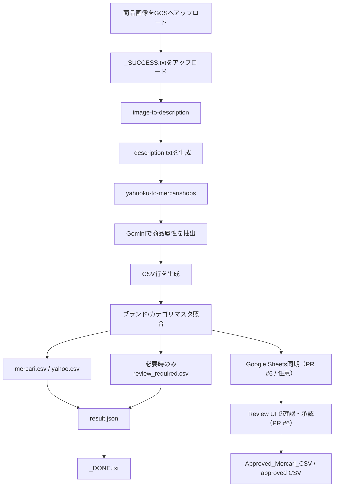

# Mercari Shops / Yahooオークション 自動出品CSV生成ツール

## 採用担当者向け要約

個人で運営していたリユース事業の出品作業を効率化するために開発した、生成AIとGoogle Cloudを使ったEC出品支援MVPです。

商品画像と採寸・状態メモをGoogle Cloud Storageへ配置すると、Cloud Run Functionsが起動し、Geminiを用いて商品説明や商品属性を生成し、メルカリShops向けCSVとYahooオークション向けCSVを出力します。

現時点の安定版では、メルカリShopsへのCSVアップロード、下書き保存、下書き画面での商品画像表示まで実機検証済みです。Yahooオークション向けCSV生成機能も実装していますが、Yahooオークション側への実投入は未検証です。

このリポジトリは完成SaaSではなく、実務課題を起点に開発したMVP・ポートフォリオです。AI生成結果は人間確認を前提にしており、このPRではGoogle Sheets / Review UIを使った承認フローを追加しています。

---

## 現在の公開状態

| 区分 | 状態 | 補足 |
|---|---|---|
| main | 安定版MVP | GCS上にCSV/JSONを出力する構成 |
| PR #6 | 最新開発ブランチ | Google Sheets承認フローとReview UIを追加 |
| PR #5 | 旧プロトタイプ | PR #6へ役割を移しているため、現時点では参照優先度を下げる |

採用・ポートフォリオ用途では、まずmainを安定版として見せ、PR #6を「次期改善・開発中の承認フロー」として説明します。

---

## 検証状況

| 項目 | 状態 |
|---|---|
| メルカリShops向けCSV生成 | 実装済み |
| メルカリShops CSVアップロード | 実機検証済み |
| メルカリShops下書き保存 | 実機検証済み |
| 下書き画面での商品画像表示 | 実機検証済み |
| Yahooオークション向けCSV生成 | 実装済み |
| YahooオークションへのCSV実投入 | 未検証 |
| Google Sheets承認フロー | PR #6で追加中 |
| Review UI | PR #6で追加中 |

Yahooオークション側は、公開資料や面接では「Yahooオークション向けCSV生成機能」と表現します。「Yahooオークション出品まで実機検証済み」とは表現しません。

---

## 入力仕様

外注スタッフまたは運用者が商品フォルダへアップロードするものは、通常運用では以下のみです。

- 商品画像
- `_SUCCESS.txt`

`_SUCCESS.txt` の本文に、採寸、状態、特記事項などの商品メモを書きます。`product_info.txt` は通常運用の入力ファイルとして使いません。

入力イメージ:

```text
products/
  sample-item/
    001.jpg
    002.jpg
    _SUCCESS.txt
```

---

## 出力物

安定版のmainでは、Cloud Storage上に以下の成果物を出力します。

```text
exports/
  {batch_id}/
    mercari.csv
    yahoo.csv
    review_required.csv
    result.json
    _DONE.txt
```

`_DONE.txt` はCSVとJSONの生成が成功した場合のみ最後に作成します。

PR #6でGoogle Sheets承認フローを有効にする場合も、既存のGCS成果物は維持します。

---

## 全体フロー


```mermaid
flowchart TD
    A[商品画像をGCSへアップロード] --> B[_SUCCESS.txtをアップロード]
    B --> C[image-to-description]
    C --> D[_description.txtを生成]
    D --> E[yahuoku-to-mercarishops]
    E --> F[Geminiで商品属性を抽出]
    F --> G[CSV行を生成]
    G --> H[ブランド/カテゴリマスタ照合]
    H --> I[mercari.csv / yahoo.csv]
    H --> J[必要時のみreview_required.csv]
    I --> K[result.json]
    J --> K
    K --> L[_DONE.txt]
    H --> M[Google Sheets同期（PR #6 / 任意）]
    M --> N[Review UIで確認・承認（PR #6）]
    N --> O[Approved_Mercari_CSV / approved CSV]
```

---

## サービス構成

### image-to-description

`_SUCCESS.txt` のアップロードをトリガーに、同じ商品フォルダ内の画像と採寸・状態メモをGeminiへ送信し、商品説明生成用の `_description.txt` をCloud Storageへ保存します。

### yahuoku-to-mercarishops

`_description.txt` のアップロードをトリガーに、メルカリShops向けCSVとYahooオークション向けCSVを生成します。

主な処理は次の通りです。

- 同じ商品フォルダ内の画像URLをファイル名順に取得
- Geminiから商品属性を取得
- 商品タイトル・商品説明をCSV仕様に合わせて整形
- ブランド名をブランドマスタからブランドIDへ変換
- カテゴリ情報をカテゴリマスタからカテゴリIDへ変換
- 低信頼度またはマスタ未一致の項目を `review_required.csv` へ出力
- メルカリShops用CSVとYahooオークション用CSVを列名ベースで生成
- 処理結果を `result.json` に保存
- `SPREADSHEET_ID` が設定されている場合のみGoogle Sheetsへ同期する

### review-ui（PR #6）

PR #6では、Cloud Run上で動かすレビュー用フロントエンドを追加しています。

Review UIでは、Google Sheets上の下書き行を確認・編集し、承認済みの行だけをメルカリShops投入用CSVとして再生成します。

---

## メルカリShopsの商品画像

`Draft_Mercari_List` と商品単位の中間 `mercari.csv` では、`商品画像名_1` 〜 `商品画像名_20` に非公開GCS画像の参照URLを保持します。これらはReview UI内部で使う下書きデータであり、メルカリShopsへ直接アップロードする最終CSVではありません。

Review UIの `Generate CSV` で作る `exports/{batch_id}/approved/mercari_shops.csv` だけがアップロード用です。最終CSVでは、承認済み商品の画像をメルカリShopsが取得できる7日間有効の署名付きURLへ変換します。バケット自体は公開しません。

最終CSVは公式テンプレートと同じ88列、UTF-8 BOM付きで出力します。商品画像、商品名、価格、カテゴリID、在庫、状態、配送項目などに公式仕様違反がある場合はCSVを生成せず、Review UIへ商品管理コードと修正項目を表示します。

運用上の注意点:

- `Generate CSV` 後、7日以内にメルカリShopsへアップロードする
- 7日を過ぎた場合は `Generate CSV` をもう一度実行してURLを更新する
- 画像はCSV投入と商品登録確認が終わるまでGCSから削除しない
- 画像ファイル名には日本語・空白・特殊記号を避ける
- 最終的な画像順序はReview UIの商品編集画面で確認する
- メルカリShops画像は最大20枚まで扱う

---

## review_required.csv

通常商品は確認CSVへ出力しません。確認が必要な商品のみ、次の列で出力します。

```csv
商品管理コード,確認項目,候補1,候補2,理由
```

主な出力条件:

- ブランドIDが特定できない
- カテゴリIDが特定できない
- AIのカテゴリ信頼度がしきい値未満
- 人間確認が必要な生成結果がある

---

## PR #6: Google Sheets承認フロー / Review UI

PR #6では、既存のGCS成果物を維持したまま、Google SheetsとReview UIを使った人間確認フローを追加しています。

追加する主な要素:

- `Draft_Mercari_List`: メルカリShops用CSVと同じヘッダーの下書き行
- `Review_List`: 商品ごとの確認理由と `review_status`
- `Approved_Mercari_CSV`: `approved` の行だけを再生成した最終CSV用シート
- `Yahoo_List`: Yahooオークション向けCSV行
- `review-ui/`: Cloud Run上で動かすレビュー用フロントエンド
- `export_approved_mercari_csv`: 承認済みCSVを再生成するHTTP entrypoint

Google Sheets同期が有効な場合、`mercari.csv`、`yahoo.csv`、`review_required.csv`、`result.json` とSheets同期が成功した後に `_DONE.txt` を作成します。Sheets同期に失敗した場合は `_DONE.txt` を作らず、Cloud Functionsのリトライ対象にします。

承認済みCSVを作るときは、`Review_List.review_status` を `approved` にしたうえで、Review UIまたは `export_approved_mercari_csv` から指定batchのCSVを再生成します。

本番利用前には、Cloud Run IAP、サービスアカウント権限、Spreadsheet編集権限、Review UIの画像表示、CSV再投入を確認します。

---

## Google Cloud Run Functionsへのデプロイ方針

このリポジトリには、実際のGoogle CloudプロジェクトID、バケット名、シークレット名、APIキー本体は含めません。環境ごとに異なる値はCloud Run Functionsの環境変数として設定します。

APIキー本体はSecret Managerへ保存し、`yahuoku-to-mercarishops` にはSecret Managerのシークレット名だけを渡します。

代表的な環境変数:

| 関数 | 環境変数 | 用途 |
|---|---|---|
| image-to-description | `PROJECT_ID` | Vertex AIを利用するGCPプロジェクトID |
| image-to-description | `PROMPT_BUCKET_NAME` | プロンプトファイルを置くGCSバケット |
| image-to-description | `PROMPT_FILE_NAME` | 画像説明生成用プロンプト |
| image-to-description | `VERTEX_LOCATION` | Vertex AIリージョン |
| image-to-description | `VERTEX_MODEL` | Vertex AI Geminiモデル |
| yahuoku-to-mercarishops | `PROJECT_ID` | Secret Manager利用プロジェクト |
| yahuoku-to-mercarishops | `SECRET_NAME` | Gemini APIキーのSecret名 |
| yahuoku-to-mercarishops | `PROMPT_BUCKET_NAME` | プロンプトファイルを置くGCSバケット |
| yahuoku-to-mercarishops | `PROMPT_FILE_NAME` | 商品属性抽出用プロンプト |
| yahuoku-to-mercarishops | `GEMINI_MODEL` | Gemini APIモデル |
| yahuoku-to-mercarishops | `SPREADSHEET_ID` | PR #6のSheets承認フローを使う場合のみ設定 |
| review-ui | `SPREADSHEET_ID` | Review UIが参照するSpreadsheet |
| review-ui | `PRODUCT_BUCKET_NAME` | 商品画像・成果物を参照するGCS bucket |
| review-ui | `MERCARI_SIGNING_SERVICE_ACCOUNT_EMAIL` | 最終CSVの画像URLへ署名するruntime service account |
| review-ui | `MERCARI_IMAGE_SIGNED_URL_TTL_HOURS` | 署名付き画像URLの有効時間。既定値・最大値は168時間 |
| review-ui | `FLASK_SECRET_KEY` | Flask session / CSRF用secret |

`.env`、APIキー、実際のGCPプロジェクトID、実バケット名、Spreadsheet ID、secret値はGit管理しません。

---

## テスト

通常のテスト:

```bash
python -m pytest -p no:cacheprovider tests
```

重複したテストファイル名を含む検証:

```bash
python -m pytest -q tests
python -m pytest -q image-to-description/test_image_description.py
python -m pytest -q tests image-to-description/test_image_description.py
```

PR #6のReview UI関連テスト:

```bash
python -m pytest -p no:cacheprovider tests/test_review_ui.py tests/test_sheets_workflow.py
```

---

## 採用・面接での説明方針

安全で正確な説明:

```text
リユース事業の出品作業を効率化するため、商品画像と採寸・状態メモからメルカリShops向けCSVを生成するMVPを開発しました。メルカリShopsへのCSVアップロード、下書き保存、画像表示までは実機検証済みです。現在はAI出力を人間が確認・承認できるよう、Google SheetsとReview UIを使った承認フローを開発中です。
```

避ける表現:

```text
メルカリShopsとYahooオークションへの自動出品を完全実現しました。
```

理由: Yahooオークションへの実投入は未検証であり、AI生成結果も人間確認を前提としているためです。
